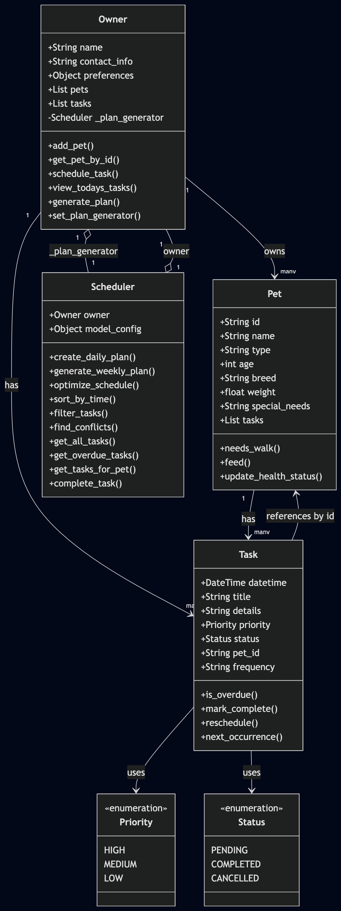

# PawPal+ (Module 2 Project)

You are building **PawPal+**, a Streamlit app that helps a pet owner plan care tasks for their pet.

## Scenario

A busy pet owner needs help staying consistent with pet care. They want an assistant that can:

- Track pet care tasks (walks, feeding, meds, enrichment, grooming, etc.)
- Consider constraints (time available, priority, owner preferences)
- Produce a daily plan and explain why it chose that plan

Your job is to design the system first (UML), then implement the logic in Python, then connect it to the Streamlit UI.

## What you will build

Your final app should:

- Let a user enter basic owner + pet info
- Let a user add/edit tasks (duration + priority at minimum)
- Generate a daily schedule/plan based on constraints and priorities
- Display the plan clearly (and ideally explain the reasoning)
- Include tests for the most important scheduling behaviors

## Features

| Feature | Description |
|---|---|
| **Pet registry** | Add multiple pets (name, species, breed, age, weight); each receives a unique UUID for safe cross-referencing. |
| **Task scheduling** | Create tasks with a date/time, title, details, priority (HIGH / MEDIUM / LOW), and status (PENDING / COMPLETED / CANCELLED). |
| **Chronological sorting** | `sort_by_time()` uses Python's built-in `sorted()` with a `datetime` key so today's task list always renders in time order, regardless of insertion order. |
| **Flexible filtering** | `filter_tasks(status, pet_name)` accepts either or both parameters and returns only the matching subset, enabling per-pet or per-status views without touching the underlying data. |
| **Conflict detection** | `find_conflicts()` iterates all PENDING task pairs with O(n²) comparison and flags every pair whose `datetime` values match exactly — across pets or within the same pet — so the UI can surface a warning before a double-booking goes unnoticed. |
| **Daily plan generation** | `generate_plan()` / `create_daily_plan()` auto-creates a full set of care tasks (walk, feed, enrichment) for each registered pet anchored to the owner's preferred walk time, then sorts the result chronologically. |
| **Daily & weekly recurrence** | `complete_task()` inspects the `frequency` field: `daily` tasks spawn a copy shifted +1 day; `weekly` tasks shift +7 days; `once` tasks are simply marked complete with no follow-up. |
| **Idempotent completion** | A guard clause in `complete_task()` checks whether the task is already `COMPLETED` before creating a recurrence, preventing duplicate entries on double-clicks. |
| **Owner ↔ Scheduler composition** | `Owner` holds a `Scheduler` reference via `set_plan_generator()`; `Scheduler` holds an `Owner` reference. Both sides delegate to each other, keeping domain logic out of the UI layer. |

## Smarter Scheduling

The `Scheduler` class includes several features beyond basic task generation:

**Auto-rescheduling recurring tasks** — When `Scheduler.complete_task(task)` is called on a `daily` or `weekly` task, it automatically creates and schedules the next occurrence (shifted by 1 day or 7 days). Tasks with `frequency="once"` are simply marked complete with no follow-up.

**Time-based sorting** — `Scheduler.sort_by_time(tasks)` returns tasks sorted by their scheduled `datetime`, making it easy to display a chronological view independent of insertion order.

**Flexible filtering** — `Scheduler.filter_tasks(status, pet_name)` accepts optional parameters to narrow tasks by completion status (`PENDING`, `COMPLETED`, `CANCELLED`), by pet name, or both combined.

**Conflict detection** — `Scheduler.find_conflicts()` scans all pending tasks and returns every pair scheduled at the exact same time, whether for the same pet or different pets. It never raises an exception — callers receive an empty list when no conflicts exist and display a warning message otherwise.

## Testing PawPal+

### Run the tests

```bash
python -m pytest
```

### What the tests cover

| Area | What is verified |
|---|---|
| **Sorting** | Tasks are returned in chronological order; same-time tasks break ties by priority (HIGH → MEDIUM → LOW) |
| **Recurrence** | Completing a `daily` task schedules a new task exactly 24 h later; `weekly` shifts by 7 days; `once` produces no follow-up |
| **Idempotency** | Calling `complete_task` twice on the same task does not create duplicate recurrences |
| **Conflict detection** | Pairs of PENDING tasks at the same datetime are flagged; completed/cancelled tasks are ignored; three-way conflicts produce all 3 pairs |
| **Task linkage** | `schedule_task` adds the task to both `owner.tasks` and the matching `pet.tasks` |
| **Status transitions** | `mark_complete` sets status to `COMPLETED`; `reschedule` resets it to `PENDING` |

### Confidence level

**4 / 5 stars**

Core scheduling behaviors — sorting, recurrence, and conflict detection — are well-covered and all 14 tests pass. One star held back because the `owner.tasks` deduplication gap (a task can be added twice via `schedule_task`) is identified but not yet fixed in the production code, and the Streamlit UI layer has no automated tests.

## Getting started

### Setup

```bash
python -m venv .venv
source .venv/bin/activate  # Windows: .venv\Scripts\activate
pip install -r requirements.txt
```

### Suggested workflow

1. Read the scenario carefully and identify requirements and edge cases.
2. Draft a UML diagram (classes, attributes, methods, relationships).
3. Convert UML into Python class stubs (no logic yet).
4. Implement scheduling logic in small increments.
5. Add tests to verify key behaviors.
6. Connect your logic to the Streamlit UI in `app.py`.
7. Refine UML so it matches what you actually built.

## 📸 Demo

### System architecture (UML class diagram)



The diagram shows the five core classes — `Owner`, `Pet`, `Task`, `Scheduler`, `Priority`, and `Status` — and their relationships. `Owner` composes `Scheduler` (via `_plan_generator`) and `Scheduler` holds a back-reference to `Owner`; both `Owner` and `Pet` aggregate `Task` lists; `Task` references its pet by UUID rather than by direct object pointer to keep coupling loose.

### App screenshot

<a href="/course_images/ai110/Screenshot 2026-03-28 at 8.03.57 PM.png" target="_blank"></a>

### App walkthrough

1. **Add a pet** — fill in name, species, breed, age, and weight, then click **Add Pet**. The pet appears in the table with a truncated UUID.
2. **Schedule a task** — choose a pet, set a date/time, enter a title and priority, click **Add Task**. Any two tasks at the exact same time immediately surface a yellow conflict warning.
3. **Filter today's tasks** — expand the filter panel, pick a pet or status, and the task table refreshes instantly showing only matching rows sorted chronologically.
4. **Generate a daily plan** — click **Generate schedule** to auto-populate a full day of care tasks for every registered pet. The plan is sorted by time and re-checked for conflicts on the spot.
