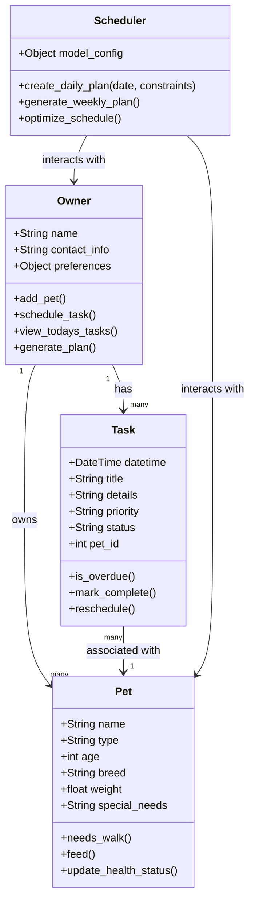

# PawPal+ Project Reflection

## Class Diagram

## 1. System Design

Three core actions:
- add a pet
- schedule a walk
- see today's tasks

Main objects
- Pet
    - Attributes: name, type of animal, age, breed, weight, special_needs (e.g., allergies or medical conditions)
    - Methods: needs_walk(), feed(), update_health_status()
    - Relationships: belongs to Owner, has many Tasks
- Task
    - Attributes: date/time, title, details, priority (high/medium/low), status (pending/completed/cancelled), pet_id (to link to a specific Pet)
    - Methods: is_overdue(), mark_complete(), reschedule()
    - Relationships: belongs to Owner, associated with Pet
- Plan Generator
    - Attributes: (potentially AI model or configuration for plan generation)
    - Methods: create_daily_plan(date, constraints), generate_weekly_plan(), optimize_schedule()
    - Relationships: interacts with Owner and Pets to generate Tasks
- Owner
    - Attributes: name, contact_info, preferences (e.g., preferred walk times)
    - Methods: add_pet(), schedule_task(), view_todays_tasks(), generate_plan()
    - Relationships: has many Pets, has many Tasks

**a. Initial design**

- Briefly describe your initial UML design.

The design uses four classes connected by ownership and association relationships. `Owner` is the central actor who holds collections of `Pet` and `Task` objects. `Scheduler` is a service class that reads from `Owner` and `Pet` to produce scheduled tasks.

- What classes did you include, and what responsibilities did you assign to each?

`Owner` manages the user's pets and task list. `Pet` stores animal profile data and exposes behavior methods like walking and feeding. `Task` represents a single scheduled action linked to a pet, tracking priority and completion status. `Scheduler` handles all scheduling logic, keeping that responsibility separate from the domain objects.

**b. Design changes**

- Did your design change during implementation?

Yes, several adjustments were made once implementation started.

- If yes, describe at least one change and why you made it.

`Task.pet_id` was originally typed as a plain `int`, but this had no stable source — nothing in `Pet` generated or enforced unique integer IDs. It was changed to a `str` UUID so each `Pet` self-generates a unique ID at creation, and tasks can reliably reference the correct pet. Additionally, `priority` and `status` on `Task` were changed from plain strings to `Enum` types (`Priority`, `Status`) to prevent silent bugs from typos like `"Pending"` instead of `"pending"`. Finally, `Scheduler` was updated to accept an `Owner` reference in its constructor, since `generate_weekly_plan()` had no way to access pet or task data without it.

---

## 2. Scheduling Logic and Tradeoffs

**a. Constraints and priorities**

- What constraints does your scheduler consider (for example: time, priority, preferences)?
- How did you decide which constraints mattered most?

**b. Tradeoffs**

- Describe one tradeoff your scheduler makes.
It uses a lambda function compared to a function call called attrgetter which is a built in C-level function.
- Why is that tradeoff reasonable for this scenario?
It is reasonable because it is more reasonable and it might be confusing what attrgetter does with someone who's new to the codebase

---

## 3. AI Collaboration

**a. How you used AI**

- How did you use AI tools during this project (for example: design brainstorming, debugging, refactoring)?
- What kinds of prompts or questions were most helpful?

**b. Judgment and verification**

- Describe one moment where you did not accept an AI suggestion as-is.
- How did you evaluate or verify what the AI suggested?

---

## 4. Testing and Verification

**a. What you tested**

- What behaviors did you test?
- Why were these tests important?

**b. Confidence**

- How confident are you that your scheduler works correctly?
- What edge cases would you test next if you had more time?

---

## 5. Reflection

**a. What went well**

- What part of this project are you most satisfied with?

**b. What you would improve**

- If you had another iteration, what would you improve or redesign?

**c. Key takeaway**

- What is one important thing you learned about designing systems or working with AI on this project?
