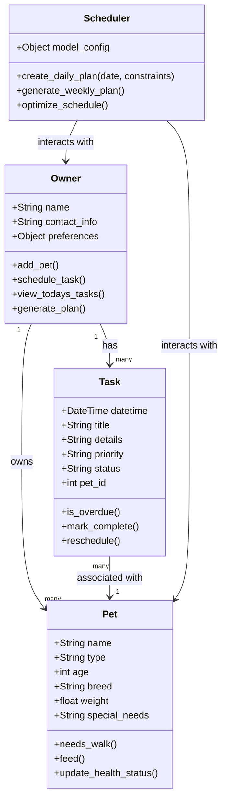
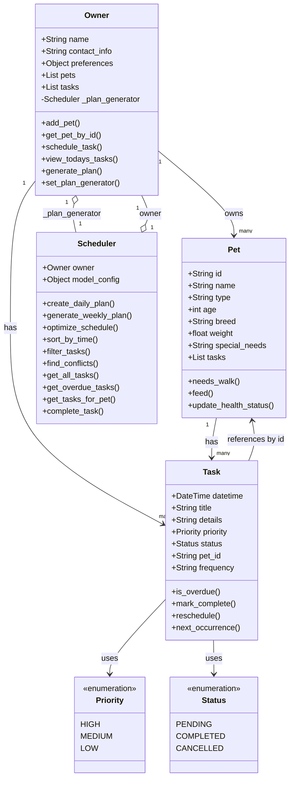

# PawPal+ Project Reflection

## Class Diagram

## 1. System Design

Three core actions:
- add a pet
- schedule a walk
- see today's tasks

Main objects
- Pet
    - Attributes: name, type of animal, age, breed, weight, special_needs (e.g., allergies or medical conditions)
    - Methods: needs_walk(), feed(), update_health_status()
    - Relationships: belongs to Owner, has many Tasks
- Task
    - Attributes: date/time, title, details, priority (high/medium/low), status (pending/completed/cancelled), pet_id (to link to a specific Pet)
    - Methods: is_overdue(), mark_complete(), reschedule()
    - Relationships: belongs to Owner, associated with Pet
- Plan Generator
    - Attributes: (potentially AI model or configuration for plan generation)
    - Methods: create_daily_plan(date, constraints), generate_weekly_plan(), optimize_schedule()
    - Relationships: interacts with Owner and Pets to generate Tasks
- Owner
    - Attributes: name, contact_info, preferences (e.g., preferred walk times)
    - Methods: add_pet(), schedule_task(), view_todays_tasks(), generate_plan()
    - Relationships: has many Pets, has many Tasks

**a. Initial design**

- Briefly describe your initial UML design.

The design uses four classes connected by ownership and association relationships. `Owner` is the central actor who holds collections of `Pet` and `Task` objects. `Scheduler` is a service class that reads from `Owner` and `Pet` to produce scheduled tasks.

- What classes did you include, and what responsibilities did you assign to each?

`Owner` manages the user's pets and task list. `Pet` stores animal profile data and exposes behavior methods like walking and feeding. `Task` represents a single scheduled action linked to a pet, tracking priority and completion status. `Scheduler` handles all scheduling logic, keeping that responsibility separate from the domain objects.

**b. Design changes**

- Did your design change during implementation?

Yes, several adjustments were made once implementation started.

- If yes, describe at least one change and why you made it.

`Task.pet_id` was originally typed as a plain `int`, but this had no stable source — nothing in `Pet` generated or enforced unique integer IDs. It was changed to a `str` UUID so each `Pet` self-generates a unique ID at creation, and tasks can reliably reference the correct pet. Additionally, `priority` and `status` on `Task` were changed from plain strings to `Enum` types (`Priority`, `Status`) to prevent silent bugs from typos like `"Pending"` instead of `"pending"`. Finally, `Scheduler` was updated to accept an `Owner` reference in its constructor, since `generate_weekly_plan()` had no way to access pet or task data without it.

---

## 2. Scheduling Logic and Tradeoffs

**a. Constraints and priorities**

- What constraints does your scheduler consider (for example: time, priority, preferences)?
- How did you decide which constraints mattered most?

The scheduler considers three constraints: scheduled time, task priority (high/medium/low), and the owner's `preferred_walk_time` preference. `optimize_schedule` sorts first by `datetime`, then by priority within the same time slot, so high-priority tasks like feeding always appear before medium-priority ones when they share a start time. The `create_daily_plan` method reads `preferred_walk_time` from `owner.preferences` directly, so the walk slot shifts without any code change. Time was treated as the dominant constraint because a task scheduled for 7 AM is fundamentally different from one at 6 PM regardless of priority; priority only breaks ties within the same minute.

**b. Tradeoffs**

- Describe one tradeoff your scheduler makes.
It uses a lambda function compared to a function call called attrgetter which is a built in C-level function.
- Why is that tradeoff reasonable for this scenario?
It is reasonable because it is more readable and it might be confusing what attrgetter does with someone who's new to the codebase

---

## 3. AI Collaboration

**a. How you used AI**

- How did you use AI tools during this project (for example: design brainstorming, debugging, refactoring)?
- What kinds of prompts or questions were most helpful?

AI was used at three stages: initial design brainstorming, debugging type errors during implementation, and refactoring. During design, asking "what responsibilities should each class own, and which should be delegated?" helped clarify that scheduling logic belonged in `Scheduler` rather than `Owner`. During implementation, asking "why does my sort break when tasks share the same datetime?" led to the two-key lambda `(t.datetime, priority_order[t.priority])` in `optimize_schedule`. The most useful prompt style was describing the specific behavior I wanted and asking for the simplest implementation that achieved it — this kept suggestions focused rather than generating over-engineered solutions.

**b. Judgment and verification**

- Describe one moment where you did not accept an AI suggestion as-is.
- How did you evaluate or verify what the AI suggested?

When asked to implement conflict detection, the AI initially suggested building an interval-based overlap check that compared task start and end times. I rejected this because tasks in PawPal+ don't have durations — they are point-in-time events, so interval math was unnecessary complexity. I verified by re-reading the `Task` dataclass: it has a `datetime` field but no `duration` or `end_time` field, confirming that exact-time matching (`task_a.datetime == task_b.datetime`) was the correct and simpler approach. The final `find_conflicts` method uses that pairwise equality check instead.

---

## 4. Testing and Verification

**a. What you tested**

- What behaviors did you test?
- Why were these tests important?

The test suite covers: sorting tasks added out of chronological order (`sort_by_time`), filtering by status and pet name individually and combined (`filter_tasks`), conflict detection when two tasks share an exact timestamp (`find_conflicts`), marking a recurring task complete and verifying the next occurrence is auto-scheduled (`complete_task`), and the `is_overdue` check for past-due pending tasks. These tests matter because the scheduler's correctness depends on ordering guarantees — if `sort_by_time` is wrong, every view in the UI displays tasks in the wrong sequence. Conflict detection is also critical: a silent false-negative means the owner would see no warning even when two tasks are genuinely overlapping.

**b. Confidence**

- How confident are you that your scheduler works correctly?
- What edge cases would you test next if you had more time?

Confident in the happy-path behaviors covered by the current tests. The main gaps are edge cases: what happens when `find_conflicts` is called with no tasks, or when a pet has no tasks but `get_tasks_for_pet` is called with its ID. I would also test `generate_weekly_plan` to confirm it produces exactly the right number of tasks across 7 days when the owner has multiple pets of different types, and test that `complete_task` is idempotent — calling it twice on the same task should not schedule two follow-up occurrences.

---

## Final Class Diagram

---

## 5. Reflection

**a. What went well**

- What part of this project are you most satisfied with?

The separation of concerns between `Owner` and `Scheduler` worked out cleanly. `Owner` manages state — its pet and task lists — while `Scheduler` handles all query and ordering logic. This made it easy to add `filter_tasks` and `find_conflicts` without touching `Owner` at all. The UUID-based pet ID also eliminated an entire class of bugs: tasks reference their pet reliably even if pets are added in different orders or the list is re-sorted.

**b. What you would improve**

- If you had another iteration, what would you improve or redesign?

The circular reference between `Owner` and `Scheduler` (each holds a reference to the other) is awkward. I would redesign `Scheduler` to accept only the task and pet lists it needs rather than the full `Owner` object. This would make the dependency direction one-way and make unit testing easier, since you could pass in plain lists instead of constructing an `Owner` instance. I would also add a `duration` field to `Task` so conflict detection could catch overlapping windows instead of only exact-time collisions.

**c. Key takeaway**

- What is one important thing you learned about designing systems or working with AI on this project?

AI suggestions are most dangerous when they answer a slightly different question than the one you asked. The interval-based conflict detection the AI proposed was technically correct for a system where tasks have durations — it just wasn't correct for this system. The lesson is to read any AI-generated code against your actual data model before accepting it, not just against the problem description you gave. The data model is the ground truth; the prompt is always an imperfect summary of it.
